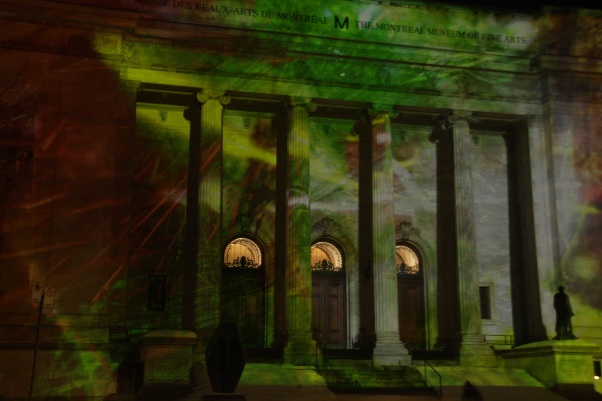
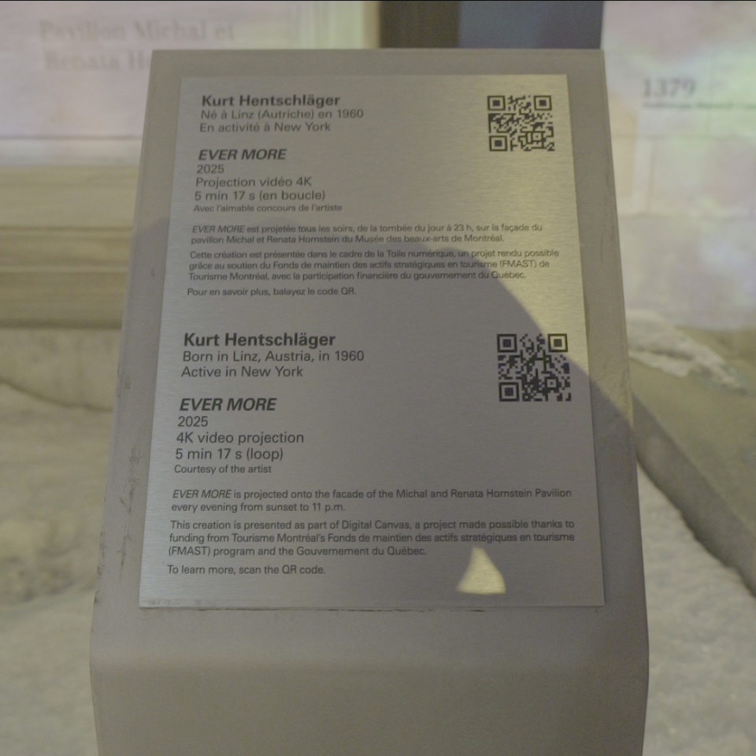
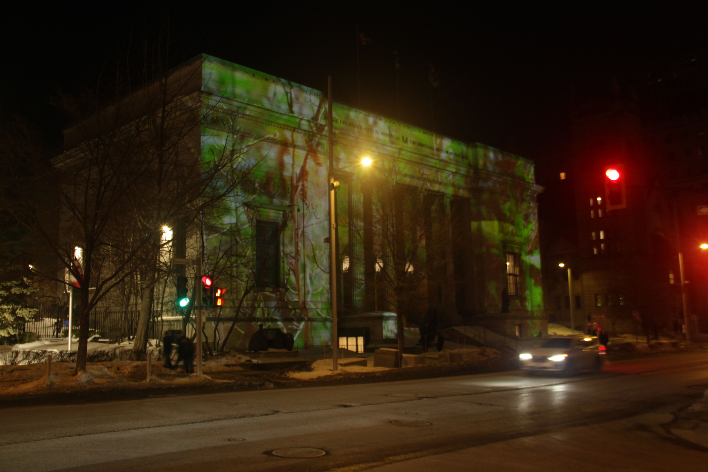
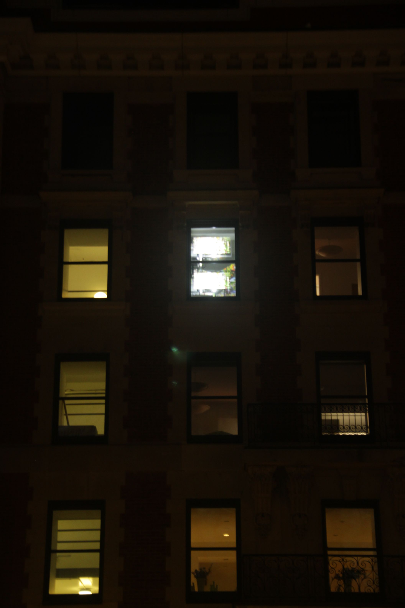

# EVER MORE de Kurt Hentschlager

>Photo de la façade avant du Musée des beaux-arts de Montréal lors de l'exposition EVER MORE de Kurt Hentschlager prise par Nanthapricha Beaulieu

## Introduction
Le jeudi 26 janvier je suis allé voir l'exposition de EVER MORE de kurt Hentschlager sur la façade du Musée des beaux-arts de Montréal. C'est une exposition extérieur contemplative fait par Kurt Hentschlager qui comprend un mixte de nature, d'humain et de technologie.

>Photo du cartel de l'oeuvre EVER MORE de Kurt Hantschlager prise par Aaron Siveesna Meas-Sop

## L'oeuvre que j'ai choisi
L'oeuvre m'a intriguer, car c'est la première fois que j'aivais l'opportunité d'aller voir une exposition multimédiatiqie extérieur tout seul et avec but de le regarder avec 100% de mon attention.

>Photo de la façade avant du Musée des beaux-arts de Montréal lors de l'exposition EVER MORE de Kurt Hentschlager prise par Nanthapricha Beaulieu

## Comment l'oeuvre fonctionne
### Pour l'utilisateur
L'utilisateur ou pour cette fois-ci l'obervateur doit simplement regarder la vidéo de 5 minutes qui se fait projeter sur la façade avant du Musée des beaux-arts de Montréal.

### Le dispositif mis en place
Le dispositif mis en place est simple: deux projecteurs situés au troisième étage de l'édifice en face du batiment du Musée des beaux-arts de Montréal.

### Matériel nécessaire
- Deux projecteurs vidéo
- Un ordinateur
- Un grand mur (donner par le musée)

## Diagramme de l'oeuvre

>Photo de la façade avant du Musée des beaux-arts de Montréal lors de l'exposition EVER MORE de Kurt Hentschlager prise par Nanthapricha Beaulieu

>Photo des projecteurs utiliser dans l'oeuvre EVER MORE de Kurt Hentschlager.

## De quoi parle l'oeuvre
L'oeuvre parle des effets psychologiques et esthétiques de l'impaacte de l'activité humaien sur la nature. IL offre une expérience à la fois naturel et créé par l'humain. Les images qui sont présentées pendant la vidéo alterne entre la nature (bourgeon d'arbre), la technologie (rendu 3D de ficelle qui s'entre croise) et l'Homme (image de peinture avec le même style que la nuit étoilée de Van Gogh).

## Mon avis sur l'oeuvre
### Pour le bon: 
L'oeuvre est très bien installée et il n'y a pas eu de bug pendant mon expérience. Les images fait en 3D sont à la fois bizarre et familier à cause de la popularité des films sci-fi, ce qui rend l'ouevre intéressant a voir. L'oeuvre est gratuite à voir et le trajet pour s'y rendre est plutôt simple en métro, bus et REM.

### Pour le mauvais:
Les projecteurs ne sont pas assez puissant même en pleine nuit (j'étais sur place vers 10:30 du soir) et le fait qe la façade fait face à une rue très utiliser le soir par les conducteurs de voitures n'aide pas au manque de puissance du dispositif. 

Sans l'utilisation du cartel, il est très difficile de comprendre ce que l'artiste veut dire. Même si je comprend que la durée de l'oeuvre doit être courte et que se n'est pas tout le monde qui a plus que 5 minutes à regarder une oeuvre extérieur, j'aurais apprécier une expérience un peu plus longue (environ 10 min) pour permettre une meilleur compréhension du message de l'oeuvre. 

### Avis final
L'oeuvre en elle-même est très intéressante et comprend une complexe relation entre la nature, l'Homme et la technologie.

>

## Référence
[EVER MORE de Kurt Hentschlager](https://www.mbam.qc.ca/fr/expositions/kurt-hentschlager-ever-more/)
