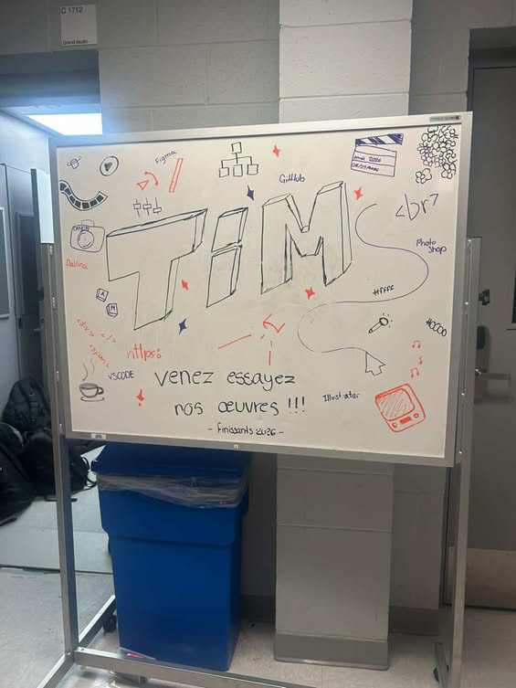

# Terminal de Émerik Béliste, Elie Daher, Ting Yung Lu Terry, Dana Saavedra-Torrano et Mégane Ranger

>Logo de TIM à l'entrée du grand studio de Montmorency pris par Rosa-Lee Savoie

## Introduction
Terminal est un projet des finissants du programme de multimédia du collège Montmorency. Le projet est un mini-jeu qui utilise le téléphone des visiteurs pour controller un personnage. Le style de jeu est similaire à des vieux jeux d'arcade (ex. Pac Man).

>Cartel de l'oeuvre de Marie-eve Levasseur de l'oeuvre "techno-compost". La photo a été prise par Nanthapricha Beaulieu dans un contexte scolaire.

## L'oeuvre que j'ai choisi
J'ai choisi l'oeuvre Terminal. Elle s'est situé dans le grand studio du collège Montmorency. Cette oeuvre intéractive est temporaire et ma visite à été le 24 février 2026 lors de la pause commune. 

L'oeuvre à été créée et présenté par Émerik Béliste, Elie Daher, Ting Yung Lu Terry, Dana Saavedra-Torrano et Mégane Ranger lors de la session d'hiver 2026 à Montmorency.

>Photo qui montre la façon que l'oeuvre de Marie-eve Levasseur est placé. La photo a été prise par Nanthapricha Beaulieu dans un contexte scolaire.

## Comment l'oeuvre fonctionne

### Pour l'utilisateur
L'utilisateur utilise son téléphone pour controller un personnage dans le jeu en scannant un code QR. Il a ensuite la possibilité de faire tourner son personnage à gauche ou 
à droite grâce aux deux boutons qui vont apparaître sur son écrant de téléphone.

### Le dispositif mis en place
Le dipositif est un pc connecté au WIFI et à un projecteur qui projette l'image du jeu sur le mur. Les joeurs se connectes grâce à un routeur WIFI

### Matériel nécessaire
- Ordinateur principal sur chariot (1): PC de contrôle exécutant Unity, gère le jeu, les connexions et la projection.

- Projecteur (1): Projection murale grand format pour afficher la zone de jeu commune.

- Tablettes / phones (1-6): Contrôleurs utilisés par les joueurs (connexion Wi-Fi).

- Routeur Wi-Fi (1): Permet la connexion des téléphones si le jeu est accessible via navigateur mobile.

- Haut-parleurs amplifiés (2): Diffusion stéréo des sons du jeu pour renforcer l’immersion collective.

- Sender / Receiver (1 chaque): Permet de connecter le cable video de l'ordinateur vers le projecteur.

- Cables Ethernet (3 à 4): Connectez les matériaux à l'internet

- Câbles vidéo (1): HDMI ou DisplayPort reliant le PC au projecteur.

- Câbles audio (2): XLR pour relier la sortie audio aux haut-parleurs.

- Câbles d’alimentation: Selon les haut-parleurs et le projecteur.

- Multiprise / rallonge électrique – Pour alimenter l’ensemble du système.

- Lumière plafond American DJ

- Lumière Baton (2-4): Mettre de la lumière d'ambiance qui change avec une donné en boucle

- Boite de lumière (1): Permet de brancher les lumière en daisy chain et les reliers à l'ordinateur

- Ralonges pour lumières (2-4) Brancher les lumières mêmes si elles sont loins l'une et l'autre

- Power supply pour boite à lumière: Donner le power à la boite à lumières

- Boules de connections de lumières (2): Faire tenir les lumières droites

- Carte graphique extérieur (1): Pour projeter les données vers les couleurs de lumières

>Photos de deux élève en immersion dans l'oeuvre de Marie-eve Levasseur "Techno-compost". La photo a été prise par Nanthapricha Beaulieu dans un contexte scolaire.

## Diagramme de l'oeuvre

>Photo d'un casque Vr sur une dchaise dans l'oeuvre "Techno-compost" de Marie-eve Levasseur. La photo a été prise par Nanthapricha Beaulieu dans un contexte scolaire.

## Mon avis sur l'oeuvre
J'ai eu beaucoup de plaisir lors de ma visite de l'exposition intéractive Terminal. L'utilisation de l'interface est facile et le jeux est simple, mais vraiment cool à jouer.

Pour mes plaintes:
- La difficulté de certain niveaux sont beaucoup plus élevés que les autres et cela peut rendre l'expérience un peu moins plaisantes.
- La connection à travers un code QR est très cool, mais il serait sdimprtant de donner une alternative pour les gens qui ont une caméra brisée. Une autre façon de se connecter pourrait être une mot de passe sur le site web du jeux. 

J'aimerais retenir l'utilisation de routeur wifi pour pouvoir se connecter à l'oeuvre à travers nos téléphones.

>Photo de l'élève Nanthapricha beaulieu devant l'affice de la galerie de l'université de Montréal. La photo a été prise par Amélie Pelletier dans un contexte scolaire.

## Référence
Photo prise par: Nanthapricha Beaulieu et Amélie Pelletier dans un contexte scolaire.

[Galerie de UDEM](https://galerie.umontreal.ca/devenirs-partagees-pratiques-de-lia.php)
