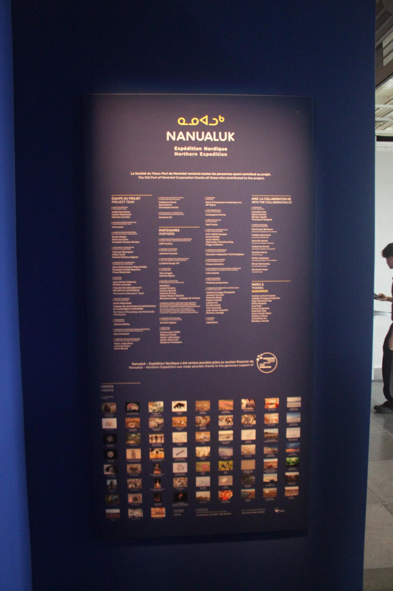
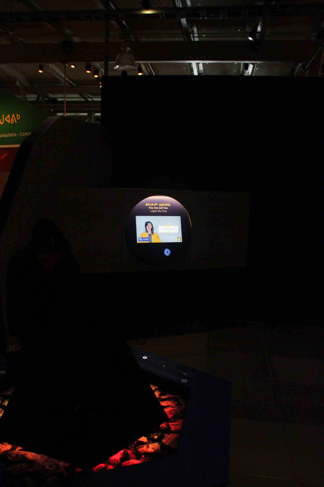
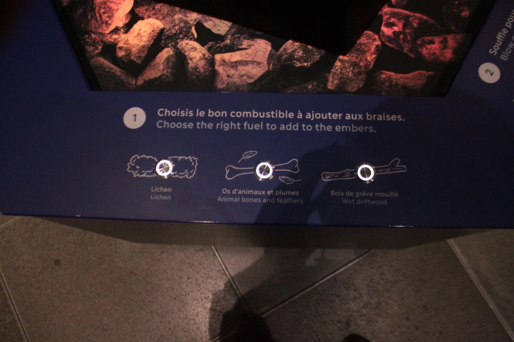
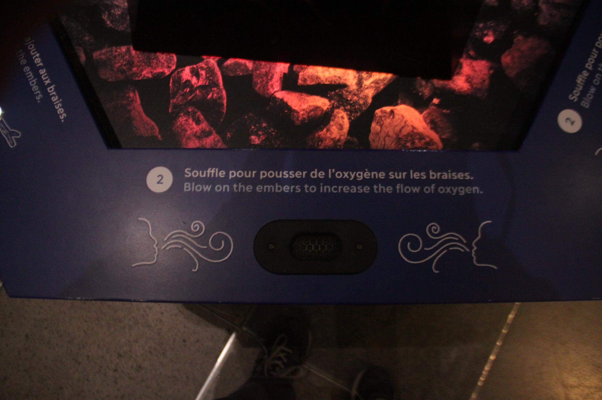
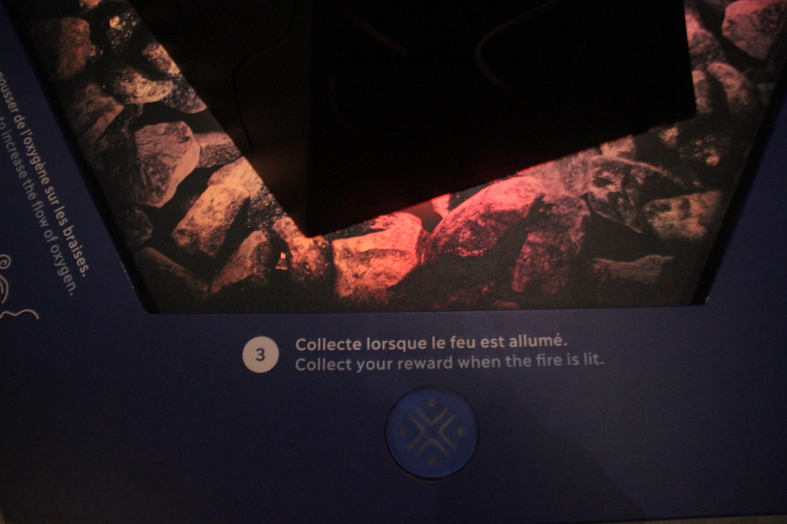
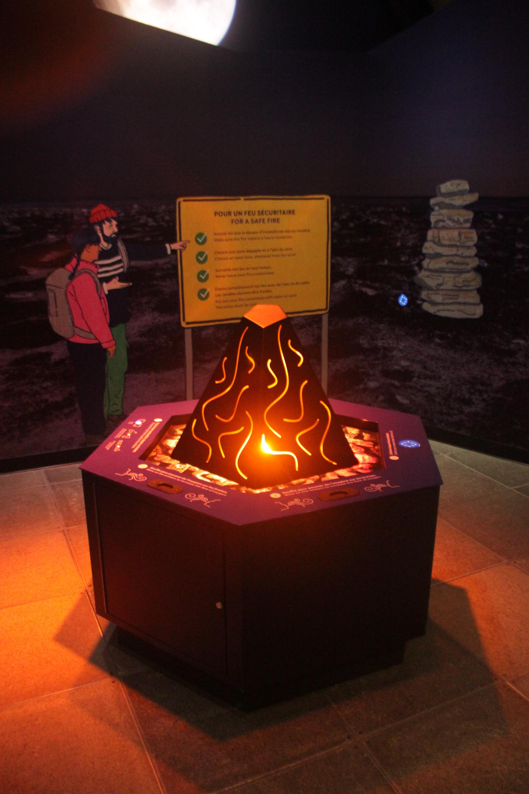
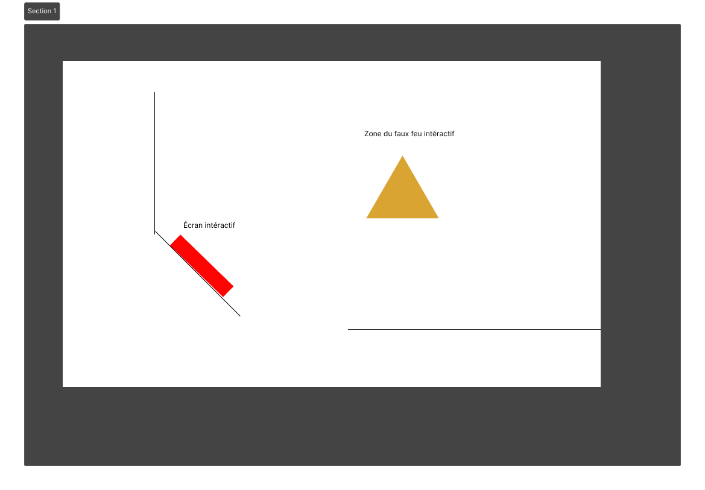

# Feu feu joli feu par le centre des sciences de Montréal en collaboration avec GSM project dans le projet Nanualuk

## Introduction
Feu feu joli feu est une istallation dans le projet Nanualuk par le centre des sciences de Montréal en collaboration avec GSM project. Il a pour but de créer un environment intéractif par rapport à la survie des indigènes du Canada et de la légende du Nanualuk.

>[Cartel de l'exposition Nanualuk au Centre des sciences de Montréal prise par Nanthapricha Beaulieu

## L'oeuvre que j'ai choisi
J'ai choisi l'oeuvre Feu feu joli feu. Elle est situé dans le centre des sciences de Montréal. C'est une oeuvre intéractive dans le projet Nanualuk. Cette oeuvre intéractive est permanente et ma visite de celle-ci à été le 1 avril 2026.

L'oeuvre Feu feu joli feu à été créée et présenter par le centre des sciences de Montréal en collaboration avec GSM project à partir du 1er mars 2025 et restera là comme oeuvre permanente.

>Photo de la zone de l'activité Feu feu joli feu dans l'exposition Nanualuk au Centres des sciences de Montréal prise par Nanthapricha beaulieu

## Comment l'oeuvre fonctionne

### Pour l'utilisateur
- L'utilisateur doit d'abord intéragir avec l'écran intéractif avec le médaillon donné au début de l'exposition. 
- Le personnage dans l'écran va ensuite donner à l'utilisateur un défi: allumer un feu.  
- L'utilisateur doit ensuite choisir le bon combustible pour allumer le feu au milieu de la pièce.
- L'utilisateur doit souffler dans le trou à côté du feu pour lui donner l'oxygène.
- Il peut ensuite collecter le feu et le redonner au personnage sur l'écran.
- Le personnage va finalement donner à l'utilisateur son badge.

### Le dispositif mis en place
Le dispositif comporte deux éléments pricipaux : L'écran et le faux feu au milieu. Le badge permet de faire la communication entre les deux éléments de l'oeuvre.

### Matériel nécessaire
- Ordinateur pour faire marcher l'écran
- Une carte carte programmable pour le faux feu au milieu de la pièce
- Le badge donné au début de l'exposition
- Des boutons en allumium pour pouvoir choisir le bon combustible.
- Un pad qui peut communiquer avec le badge
- Une plateforme pour tenir le faux feu
- Les plaques d'alluminium pour faire la structure du faux feu
- Une lumière pour indiquer si le feu est mort ou allumer
- Un cadrage pour l'écran
- Un écran intéractif

>>Photos de l'activité Feu feu joli feu dans l'exposition Nanualuk au Centres des sciences de Montréal prise par Nanthapricha Beaulieu

## Diagramme de l'oeuvre

>Diagramme de l'oeuvre Feu feu joli feu dans l'exposition Nanualuk au Centre des sciences de Montréal

## Mon avis sur l'oeuvre
L'oeuvre est très intéressante et innovative selon moi. C'est la première fois que je vois une eouvre utiliser le souffle pour pouvoir passer à la prochaine étape. J'aimerais pouvoir utiliser ce genre d'intéraction dans l'un de mes projets.

Mes plaintes :
- Le trou où il faut souffler est un peu petit et pourrais causer des problème sanitaire sur le long terme.

>Photo de l'élève Nanthapricha beaulieu devant l'affice de la galerie de l'université de Montréal. La photo a été prise par Amélie Pelletier dans un contexte scolaire.

## Référence
Photo prise par: Nanthapricha Beaulieu et Amélie Pelletier dans un contexte scolaire.

[Exposition Nanualuk](https://www.centredessciencesdemontreal.com/exposition-permanente/nanualuk-expedition-nordique)
