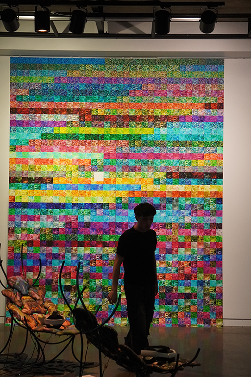
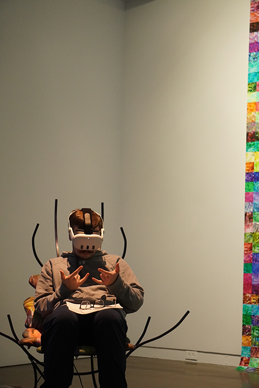
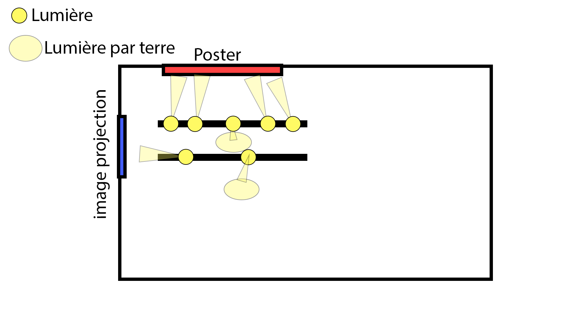

# TECHNO-COMPOST de Marie-eve Levasseur

>Photo de l'une des chaise et l'un des casques VR dans l'oeuvre "Techno-compost" de Marie-eve Levasseur fait durant une sortie scolaire. La photo a été prise par Nanthapricha Beaulieu dans un contexte scolaire.

## Introduction
Le 30 janvier 2026 à la galerie de l'université de Montréal, j'ai pu observer l'une des oeuvre de l'exposition nommée "Devenir partage. Pratique de l'IA". C'est une exposition temporaire qui se situe à l'intérieur du batiment la galerie de Montréal. Celle-ci finissait le 30 janvier 2026.

>Cartel de l'oeuvre de Marie-eve Levasseur de l'oeuvre "techno-compost". La photo a été prise par Nanthapricha Beaulieu dans un contexte scolaire.

## L'oeuvre que j'ai choisi
L'oeuvre qui m'a le plus intrigué est la création nommé "Techno-compost" de Marie-eve Levasseur créer en 2025. Elle consiste de deux chaise placer dans le coin d'une piece à environ 6m des murs avec un casque VR sur chacunes des chaises, un poster sur le mur et septs lumières. La première photo montre les chaises avec un poster sur le mur qui contient certaines des photos qui ont été "compostés". Il y a aussi quatre projecteurs qui pointes vers le poster pour l'éclairer dans la salle qui est généralement sombre. Même si on ne peut pas tous les voires, deux lumières sont assignées à l'éclairage des chaises au milieu de l'oeuvre. La deuxième montre l'une des chaise qui connectée au pc qui permet de s'occuper du bonfonctionnement de l'oeuvre, la création de l'univers 3D visible dans les casques VR ainsi qu'à la projection d'une des image "compostées" à l'aide d'un projecteur monté sur le plafond de la galerie. La dernière lumière est utilisées pour illuminer le cartel de l'oeuvre.

>Photo qui montre la façon que l'oeuvre de Marie-eve Levasseur est placé. La photo a été prise par Nanthapricha Beaulieu dans un contexte scolaire.

## Comment l'oeuvre fonctionne
L'utillisateur peut intéragir avec le monde 3D avec les casques VR et leurs fonctionalitées de visualisation 3D grâce à des caméras et scaneurs situés à l'avant des casques. Cela permet de déplaces dans l'oeuvre 3D avec les mouvement de nos mains tout en restant assis. Il aussi possible de regarder le poster sur le mur droit ainsi que la projection sur le mur gauche. L'oeuvre en général est donc tcontemplative et intéractive.

>Photos de deux élève en immersion dans l'oeuvre de Marie-eve Levasseur "Techno-compost". La photo a été prise par Nanthapricha Beaulieu dans un contexte scolaire.

## Diagramme de l'oeuvre

## De quoi parle l'oeuvre
Marie-eve Levasseur a découvert un fichier caché qui garde toutes les images non utilisées lors de création générative d'image à l'aide de l'IA. Elle a donc décidées de "composter" ces images oubliées pour leur donner une deuxième vie dans son oeuvre "Techno-compost". On peut alors voirs ces images compostées tomber du ciel dans les casques vr et de voir leur destruction par des créatures insectoides qui mangent et compostent les images.

>Photo d'un casque Vr sur une dchaise dans l'oeuvre "Techno-compost" de Marie-eve Levasseur. La photo a été prise par Nanthapricha Beaulieu dans un contexte scolaire.

## Mon avis sur l'oeuvre
J'ai trouvé le concept de l'oeuvre vraiment intéressant avec les images compostées de l'IA générative. Je trouve que l'emplacement et la forme des chaises ainsi que les casques VR permettent une immersion complète dans l'oeuvre.

Les deux plaintes sont que le poster sur le mur dépasse sur le plancher et que la mousse qui fait contact sur la peau sur les casques VR peut causer de l'irritation ou une réaction allergique.

J'ai eu un grand plaisir à observer et utiliser l'oeuvre de Marie-eve Levasseur et j'ai hâte de voir des créations multimédiatique similaire dans le futur.

>Photo de l'élève Nanthapricha beaulieu devant l'affice de la galerie de l'université de Montréal. La photo a été prise par Amélie Pelletier dans un contexte scolaire.

## Référence
Photo prise par: Nanthapricha Beaulieu et Amélie Pelletier dans un contexte scolaire.

[Galerie de UDEM](https://galerie.umontreal.ca/devenirs-partagees-pratiques-de-lia.php)

